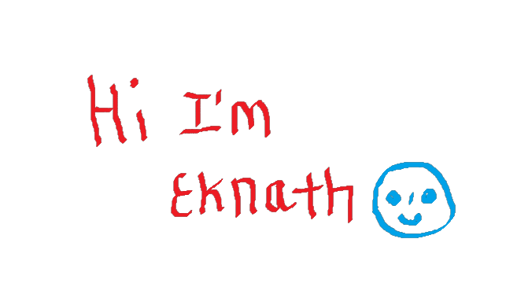

### Hi there 👋 Eknath Mali Here Welcomes you to my Profile
<!--
**eknathmali/eknathmali** is a ✨ _special_ ✨ repository because its `README.md` (this file) appears on your GitHub profile.
-->
Here are some ideas to get you started:

- 🔭 currently Studying in Second Year Computer Engineering.
- 🌱 currently learning Web Development
- 👯 looking to collaborate on Projects to gain more skills and be more confident on communication skills.
- 🤔 I’m looking for help with being a collaborator and give my best to work with best.
- 📫 Linkedln: www.linkedin.com/in/eknath-mali-5544121b9
- ⚡ Fun fact: Computer was a job title, and the first programmers were women

